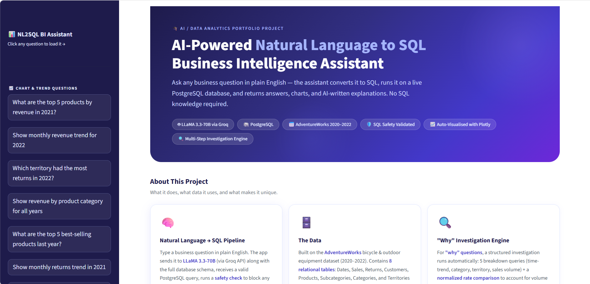
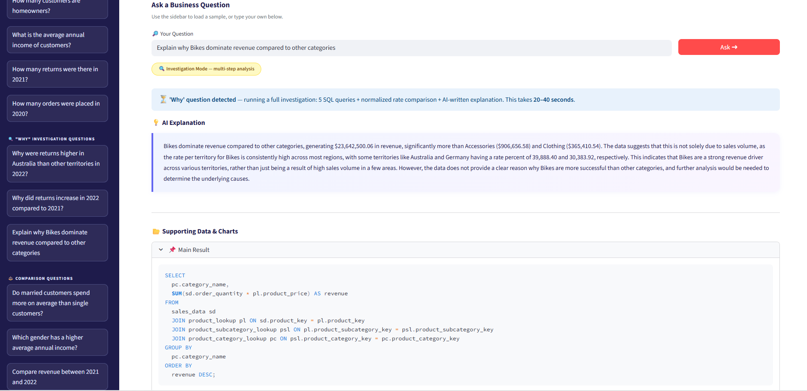
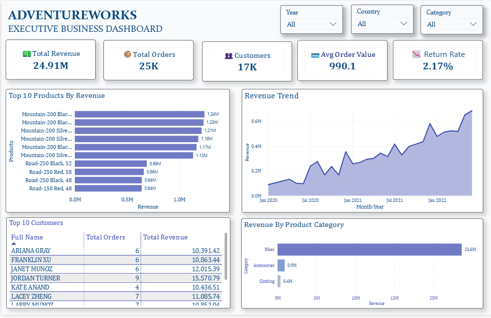
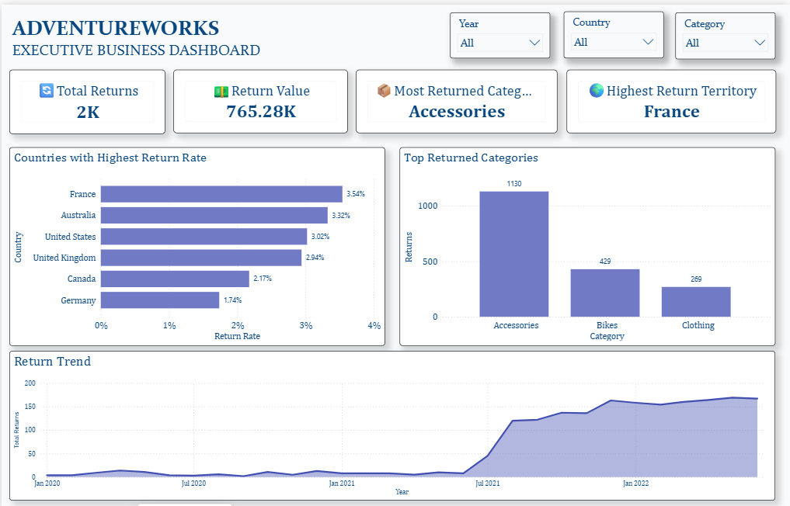
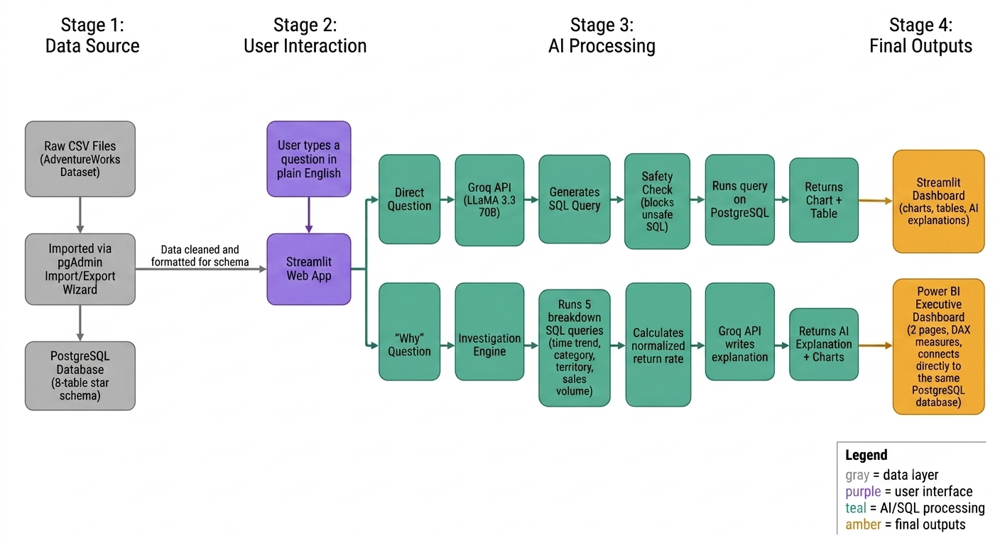

# 📊 AI-Powered Natural Language to SQL Business Intelligence Assistant

An end-to-end AI-powered business intelligence system that lets you query a PostgreSQL database using plain English. The assistant converts natural language questions into validated SQL, executes them live against the database, auto-visualizes the results, and — for "why" questions — runs a structured multi-step investigation that produces a written, data-grounded explanation.

**🔗 Live Demo:** [(https://eo2y63umwncbb93egwmjvu.streamlit.app/)]

---

## 🖼️ Screenshots

### AI Assistant — Landing Page

### AI Assistant — "Why" Investigation in Action

### Power BI — Executive Overview

### Power BI — Returns Analysis

---

## 🏗️ System Architecture

The system converts natural language into SQL using an LLM, validates generated queries before execution, retrieves results from PostgreSQL, automatically visualizes the output, and performs multi-step investigations for analytical "why" questions before generating AI-powered business insights.

🌟 Key Features
Natural Language → SQL — ask business questions in plain English, no SQL required.
"Why" Investigation Engine — causal questions trigger an automated 5-query investigation (time trend, category, territory, sales volume) plus a normalized rate comparison, synthesized into a plain-English explanation by the LLM.
Safety Validated — a code-level guardrail (independent of the prompt) blocks any non-SELECT statement before it can reach the database.
Auto-Visualization — results are automatically rendered as line or bar charts based on the shape of the returned data, with a preference for normalized rate metrics over raw counts when both are available.
Executive Dashboard (Power BI) — a complementary, always-on reporting layer with DAX measures for revenue, returns, and territory analysis.
Tested — 18 automated unit tests covering the SQL safety guard, rate-normalization logic, and chart-selection logic, run automatically on every push via GitHub Actions.
🧠 What Makes This Interesting

Most NL-to-SQL demos stop at "ask a question, get a table." This project goes further: a "why" question isn't answered with a single query, because a single query can only retrieve data, not explain causation. Instead, the investigation engine runs a fixed sequence of breakdown queries and — critically — computes a normalized rate rather than relying on raw counts.

This caught a real analytical pitfall during development: an early version, using raw return counts only, suggested Australia had an anomalously high return rate (208 returns — the highest of any territory). After adding volume normalization, the system correctly revised its own conclusion: Australia's actual return rate (2.19%) was unremarkable — France (2.67%) and Southeast (2.86%) were both higher. The high raw count was simply a function of Australia having more sales volume, not an underlying problem. The system's own AI-generated explanation catches and states this distinction.

🛠️ Tech Stack
Layer	Technology
Programming Language	Python 3.10
Database	PostgreSQL 17
ORM / Database Access	SQLAlchemy
Data Processing	pandas
LLM Inference	Groq API (LLaMA 3.3-70B)
Visualization	Plotly
Frontend	Streamlit
Dashboard	Power BI
Testing	pytest, GitHub Actions (CI)
Evaluation	pandas, CSV
🗄️ Dataset

Built on a subset of the AdventureWorks bicycle and outdoor equipment dataset, spanning 2020–2022. Star-schema design with 8 connected tables:

sales_data (fact table)
returns_data
customer_lookup
product_lookup
product_subcategory_lookup
product_category_lookup
territory_lookup
calendar_lookup
🚀 Setup Instructions
1. Prerequisites
Python 3.9+
PostgreSQL installed and running locally
A free Groq API key — no credit card required
2. Install dependencies
bash
python -m venv venv

# Windows
venv\Scripts\activate

# Mac/Linux
source venv/bin/activate

pip install -r requirements.txt
3. Environment variables
bash
cp .env.example .env

Edit .env and fill in your real DATABASE_URL and GROQ_API_KEY.

4. Load the data
Create the database and run database/schema.sql (table definitions with primary/foreign keys) in pgAdmin's Query Tool.
Import each AdventureWorks CSV into its corresponding table using pgAdmin's built-in Import/Export wizard (right-click the table → Import/Export Data). Match each CSV's columns to the table schema and use Header: ON.
Verify the row counts match expectations for each table (see the Dataset section above for the 8 tables to populate).
5. Run the application
bash
streamlit run src/nl2sql/app.py

Opens automatically at http://localhost:8501.

6. Run the tests (optional)
bash
pip install pytest
pytest tests/ -v

All 18 tests should pass. These also run automatically on every push via GitHub Actions (see .github/workflows/tests.yml).

🧪 Evaluation

The pipeline was evaluated against 14 test questions spanning simple aggregates, multi-table joins (up to 4 tables), comparisons, and deliberate edge cases (relative date phrasing, out-of-schema questions, ambiguous phrasing).

Accuracy: 92.9% (13/14)
The one failure was a question referencing a payment_method field that does not exist anywhere in the schema. Rather than a SQL-generation bug, this reflects a known limitation of schema-grounded NL2SQL: the model can still produce a plausible-sounding column name when a question presupposes data the schema doesn't contain. The same failure occurs with the hand-written expected SQL, confirming this is a data-availability limitation, not a system error.
Full evaluation scripts and results are in the evaluation/ folder.
🧾 Hand-Written SQL

Beyond the AI-generated queries, database/SQL_Analysis.sql contains a set of manually written analytical queries — revenue breakdowns, top products/customers, customer lifetime value, return-rate analysis, and window-function queries (LAG for month-over-month growth, RANK for top products per category). All evaluation ground-truth queries were also independently hand-written and verified in pgAdmin before being compared against the AI's output.

🐛 Notable Engineering Challenges
Challenge	Fix
PostgreSQL NUMERIC columns silently broke chart rendering	Columns arrive as Python Decimal, stored by pandas as object dtype, invisible to numeric-type checks — added a defensive pd.to_numeric conversion after every query
LLM occasionally returned two SQL statements for ambiguous questions	Explicit single-statement prompt rule + defensive truncation in code
EXTRACT(MONTH FROM date) broke multi-year trend charts	Discards the year, merging every January across all years into one bucket, and integer month values were misparsed as Unix-epoch timestamps by the charting layer — fixed via a DATE_TRUNC prompt rule plus a defensive check in the chart's date-detection logic
Free-tier LLM provider access denied at the platform level	Migrated from Google Gemini to Groq (LLaMA 3.3-70B) — a different provider with a reliable free tier
📂 Project Structure
text
AI-Business-Analyst/
├── .github/
│   └── workflows/
│       └── tests.yml
│
├── data/
│   └── AdventureWorks *.csv (8 files)
│
├── database/
│   ├── schema.sql
│   └── SQL_Analysis.sql
│
├── docs/
│   └── architecture.png
│
├── evaluation/
│   └── Evaluation.csv
│
├── powerbi/
│   ├── adventureworksdashboard.pbix
│   └── Dashboard_Screenshots/
│
├── src/
│   └── nl2sql/
│       ├── app.py
│       ├── nl2sql.py
│       ├── analysis.py
│       ├── visualize.py
│       ├── schema_context.py
│       └── evaluate.py
│
├── tests/
│   ├── conftest.py
│   ├── test_nl2sql.py
│   ├── test_analysis.py
│   └── test_visualize.py
│
├── UI/
│   ├── Landing_page.png
│   └── Why_question.png
│
├── .env.example
├── .gitignore
├── README.md
└── requirements.txt
